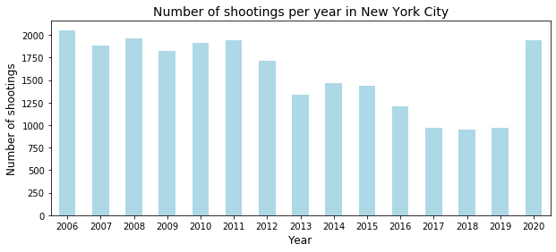
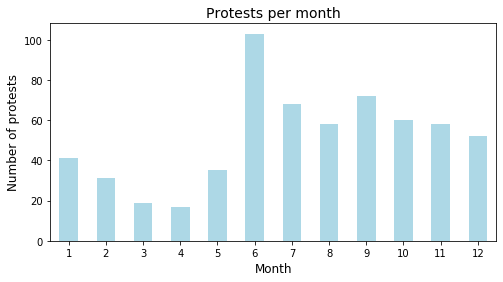

In New York City approximately 1,571 people are shot every year which corresponds to 4 people each day. Gun control is one of the most divisive issues in American politics and even though gun laws have been restricted and regulated several times, incidents of homicides caused by shootings occur relatively often compared to other Western countries.  This article investigates the risk of being shot in New York City and which areas in particular, one should avoid at specific time slots. Furthermore, it is explored whether protests had an influence on or connection to the number of shootings in New York City in 2020.  

Let’s begin by understanding how the number of shootings has evolved through the years, through an overview of the number of shootings in New York City from 2006-2020.

 

  

<small><i> The figure shows the distributions of yearly shootings in New York City. The overall trend of shootings from 2006 until 2019 is decreasing, however, there is a rapid increase of shootings in 2020. </i></small>

An interesting trend can be found in the number of shootings through the past years. In 2006 there were 2,055 shootings reported by NYPD. After a school shooting in the neighboring state, Connecticut, the New York State gun law was restricted, and the result of this can be seen when looking at the number of shootings in 2013 that decreased to 1,338.  In the next years, the overall trend in the number of shootings was descending and in 2019 it came down to 967. This makes sense as stricter gun laws would lead to less shootings one would think, however the number of shootings drastically increased in 2020 by more than 100%. What made the number of shootings increase again? 

Before trying to answer this question, let’s get a better understanding of when and where most shootings happen. New York City consists of five different boroughs: Manhattan, Brooklyn, Queens, Bronx, and Staten Island. To see which of the boroughs are worst when it comes to shootings, take a look at the following distributions for monthly, daily and hourly shootings. Feel free to filter between the different boroughs. 

<iframe src="Bokeh/bokehNew.html"
    align="left"
    sandbox="allow-same-origin allow-scripts"
    style="200%"
    width="1000"
    height="500"
    scrolling="yes"
    seamless="seamless"
    frameborder="0">
</iframe>

<small><i> The bar plots show the distributions for monthly, daily, and hourly shootings for the five boroughs. Most shootings occur in Brooklyn and Bronx in the Summer months, especially on the weekends at night. </i></small>

This is demo content.

Apparently, the risk of being shot increases during the Summer which is quite problematic when considering that this is the time of the year where most tourists come to visit New York City and citizens are more outside – but luckily the distributions can give us some helpful tips on which areas to avoid and when.  First of all, there is a lot of gun-shooting activity in Brooklyn and Bronx compared to the other boroughs, especially during the weekends in the late evening hours and in the night. Avoiding entire boroughs could be quite inconvenient which is why it is investigated which areas in particular one would be most exposed to shootings. 

Take a look at the map below, that shows all the shootings from each year including the size of the shootings in regard to victims. Feel free to click around, filter the different years and zoom in and out on the map.   

<iframe src="Maps/map_clusters.html"
    sandbox="allow-same-origin allow-scripts"
    width="100%"
    height="500"
    scrolling="no"
    seamless="seamless"
    frameborder="0">
</iframe>

<small><i> The map shows the locations and sizes of shootings and in New York City. From the map, four shooting hotspots can be identified.</i></small>

Try selecting 2010, 2012, 2017, 2018 and 2019. It is obvious to see that there are some popular shooting hotspots in the different boroughs. Take a look at Brooklyn for instance, where the Northern area is way more exposed to shootings than the Southern area. Likewise, more shootings occur in Northern Manhattan, Eastern Queens and Southern Bronx. These are areas that you should want to avoid in the weekends when it is late at night. Go to Staten Island instead where the risk of being shot is way smaller. 

Anyway, now that we have gotten an understanding of which areas that should be avoided and when let’s go back to discover what happened in 2020. The year 2020 was an eventful year. The world experienced a pandemic, there was an increased focus on race discrimination and the U.S. got a new president. This all resulted in many protests across the U.S. where specifically 614 took place in New York City. Maybe this could have influenced the increased number of shootings? 

Firstly, let’s have a look at the monthly distribution of the protests to get an understanding of when they were held. 
 

  

<small><i> The figure shows the monthly distribution of protests in New York City. The number of protests was relatively low at the beginning of 2020, but then peak in June. Afterward, the number of protests decreases but keeps at a stable level.</i></small>

It is interesting that the number of protests peaks during the Summer which was also the case for the number of shootings. The murder of George Floyd happened on the 25th of May 2020 which resulted in many protests in June by the Black Lives Matter movement. In October the restrictions for New York City were renewed which resulted in protests during the Autumn 2020. The presidential election was at the beginning of November which explains some of the protests during the time up to and shortly after the election.   

Now that we know more about the protests, let’s take a look at how many protests were held in the different boroughs. On the map below the distribution of 495 of the protests is shown since it was not possible to find the location of the remaining protests. Try hovering over the different boroughs.  

<iframe src="Maps/choropleth_mapbox.html"
    sandbox="allow-same-origin allow-scripts"
    width="100%"
    height="500"
    scrolling="no"
    seamless="seamless"
    frameborder="0">
</iframe>

<small><i> Most of the protests were organized in Manhattan and fewest in Staten Island.</i></small>

The majority of the protests were held in Manhattan and therefore, most of them were not located in the same place as most shootings were located, namely in Brooklyn. However, shootings did occur in Manhattan and some protests were also held in Brooklyn so perhaps there could be a connection between the protests and shootings. 

Let’s take a more detailed look at the exact location of the shootings in 2020 and the protests. Feel free to filter between the types of protests shown on the map. 

<iframe src="Maps/map_protest.html"
    sandbox="allow-same-origin allow-scripts"
    width="100%"
    height="500"
    scrolling="no"
    seamless="seamless"
    frameborder="0">
</iframe>

<small><i>Notice that the pop-up markers show the exact location of the protest. As the protests all lie within the same six locations, they have randomly been moved with a small distance from the original location. It is seen that few shootings took place at the exact same location as the protests.</i></small>

There were six hotspots for the protests in 2020; one on Staten Island at Westwood Hill Park, one in Brooklyn by the New York Transit Museum, two in Manhattan at Central Park and the New York City Hall, one in Bronx by Bronx Park and one in Queens by the First Baptist Church. Hereof Central Park was the most frequently used spot. Only a few shootings took place at the exact same location as the protests. This indicates that there is no clear connection between the protests and the number of shootings. However, an online research shows that the number of shootings related to hate crime increased together with the protests in 2020. This indicates that the protests could have contributed to more public unrest, street violence and perhaps more shootings. Thus, one could say that protests in 2020 had no direct influence on the increased number of shootings in 2020 but they may have contributed to the trend. 

Overall, it can be stated that the risk of being shot in New York City is bigger in the areas defined as shooting hotspots particularly in the weekend during the late evening hours and in the night. Furthermore, it cannot be eliminated, that protests contribute to more shootings, thus one should be aware of a potential higher risk when many protests are held.   

The background for the conlcusions in this article can be found at <a href="https://www.berlingske.dk/internationalt/nu-er-new-yorks-vaabenlov-strammet"> link to Jupyter Notebook</a> 

Furthere sources are used to support the article:

<small>Berlingske (2013) <i>Nu er New Yorks våbenlov strammet</i><a href="https://www.berlingske.dk/internationalt/nu-er-new-yorks-vaabenlov-strammet"> link to website</a>  (Accessed: 12-5-2021)</small>
 

<small>World Population Review (2021) <i>Gun Deaths By Country 2021</i><a href="https://worldpopulationreview.com/country-rankings/gun-deaths-by-country"> link to website</a>  (Accessed: 12-5-2021)</small>

